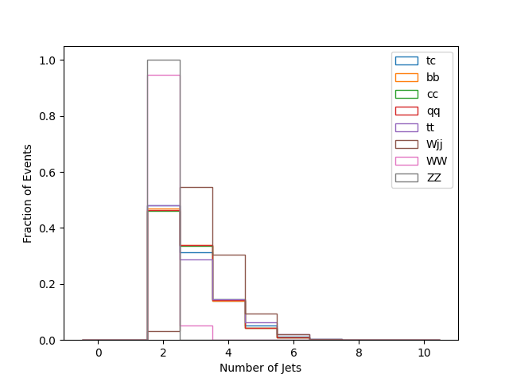
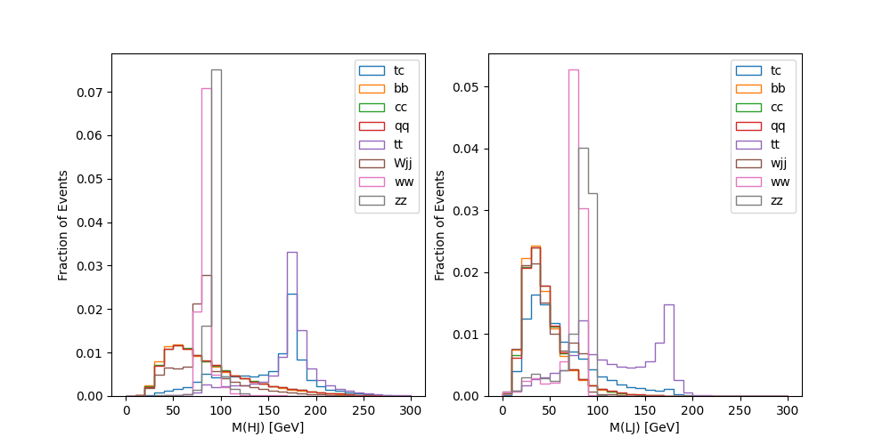

# mumutc_visualization
These codes aim to reproduce the Fig. 3(b) and Fig. 4 in publication [https://arxiv.org/pdf/2302.01143](https://arxiv.org/pdf/2302.01143) by SQL data and matplotlib. 
The output plots are: 

